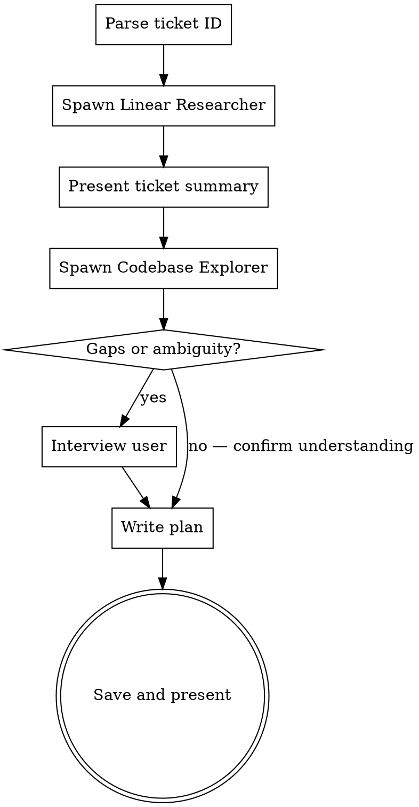

# Linear Ticket to Implementation Plan

Turn a Linear ticket into an implementation plan by gathering full context, exploring the codebase, and filling any gaps with the user.

**Invoke as:** `/linear-plan CPRO-273`

**Assumes:** You are in the root of the relevant git repo.

## Process



## Phase 1: Parse Ticket ID

Read the ticket ID from the skill argument. If no argument was provided, ask the user for it.

The argument is a Linear issue identifier like `CPRO-273`.

## Phase 2: Linear Researcher (Subagent)

Read the agent prompt from `~/.claude/skills/linear-plan/linear-researcher.md`.

Spawn an **Explore** subagent using that prompt, substituting `{TICKET_ID}` with the actual ticket ID. The subagent has access to all Linear MCP tools.

Present the returned summary to the user: "Here's what I found on the ticket."

## Phase 3: Codebase Explorer (Subagent)

Read the agent prompt from `~/.claude/skills/linear-plan/codebase-explorer.md`.

Spawn an **Explore** subagent using that prompt, injecting the ticket summary from Phase 2 as context. Set the subagent's working directory to the current repo root.

## Phase 4: Interview (Conditional)

Review the combined Linear + codebase context. Interview the user **only if**:

- The ticket description is vague or missing acceptance criteria
- There are multiple valid implementation approaches and the ticket doesn't specify which
- The ticket references domain concepts not evident in the codebase
- Comments conflict with the description or each other

Ask questions **one at a time** using `AskUserQuestion` with multiple-choice options where possible.

If no gaps exist, present a brief summary of your understanding and ask: "Does this look right before I write the plan?" as a single confirmation.

## Phase 5: Write the Plan

Save to: `docs/plans/YYYY-MM-DD-{TICKET_ID_LOWERCASE}-{SHORT_NAME}.md`

Use this format:

```markdown
# {TICKET_ID}: {Title} Implementation Plan

> **For Claude:** Use the execute-plan skill to implement this plan.

**Ticket:** {TICKET_ID}
**Goal:** {One sentence goal from ticket}
**Architecture:** {2-3 sentences about approach}

---

## Setup

1. Create and checkout branch: `git checkout -b {ticket-id-kebab-case}`
2. Transition the Linear ticket to "In Progress" via `mcp__claude_ai_Linear__update_issue` with `state: "In Progress"`

## Context

{Summary of what was learned from Linear + codebase exploration. Include enough detail
that an engineer with no prior context can understand the problem and approach.}

## Tasks

### Task 1: {Component/Area Name}

**Files:**
- Create: `exact/path/to/file.ts`
- Modify: `exact/path/to/existing.ts`
- Test: `tests/path/to/test.ts`

**What to do:**
{Clear description with enough detail for an engineer with no context.
Include code snippets where they clarify the approach.}

**Acceptance criteria:**
- [ ] {Criterion from ticket or derived from context}

**Commit:** `{type}({scope}): {description}`

---

### Task N: ...

## Testing Strategy

{Which tests to run, manual verification steps, how to confirm the work is complete.}

## Risks & Open Questions

{Anything flagged during exploration or interview. Remove section if none.}

## Completion

1. Run full test suite to verify everything passes
2. Push branch: `git push -u origin {ticket-id-kebab-case}`
3. Create PR if one doesn't exist: `gh pr create --title "{TICKET_ID}: {Title}" --body "..."` linking to the Linear ticket
4. Transition the Linear ticket to "In Review" via `mcp__claude_ai_Linear__update_issue` with `state: "In Review"`
```

**Plan guidelines:**
- Exact file paths always — never "somewhere in src/"
- Each task should be independently implementable where possible
- Include code snippets where they reduce ambiguity, but not full implementations
- Acceptance criteria from the ticket should map to specific tasks
- Keep tasks at a level where each is ~15-30 minutes of work

## Phase 6: Present and Offer Execution

After saving the plan, tell the user:

> Plan saved to `docs/plans/{filename}.md`.
>
> You can execute it with: `/execute-plan docs/plans/{filename}.md`

## Common Mistakes

| Mistake | Fix |
|---------|-----|
| Writing the plan without reading the codebase | Always run the Codebase Explorer — plans without file paths are useless |
| Interviewing when the ticket is clear | Skip the interview if Linear + codebase give enough info |
| Vague task descriptions | Each task must have exact file paths and clear "what to do" |
| Giant tasks | Break into 15-30 min chunks. If a task would take an hour, split it. |
| Ignoring ticket comments | Comments often contain critical context not in the description |
